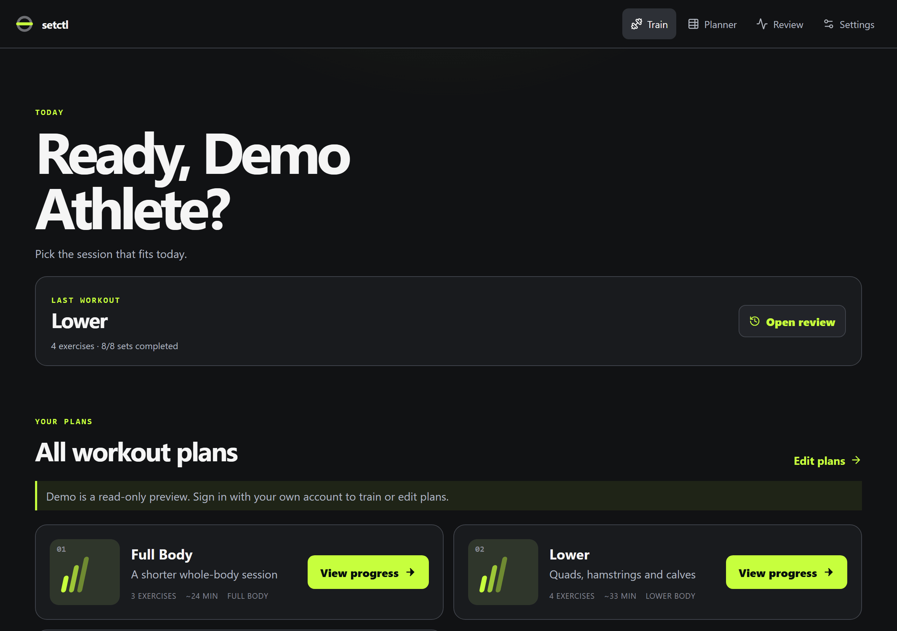
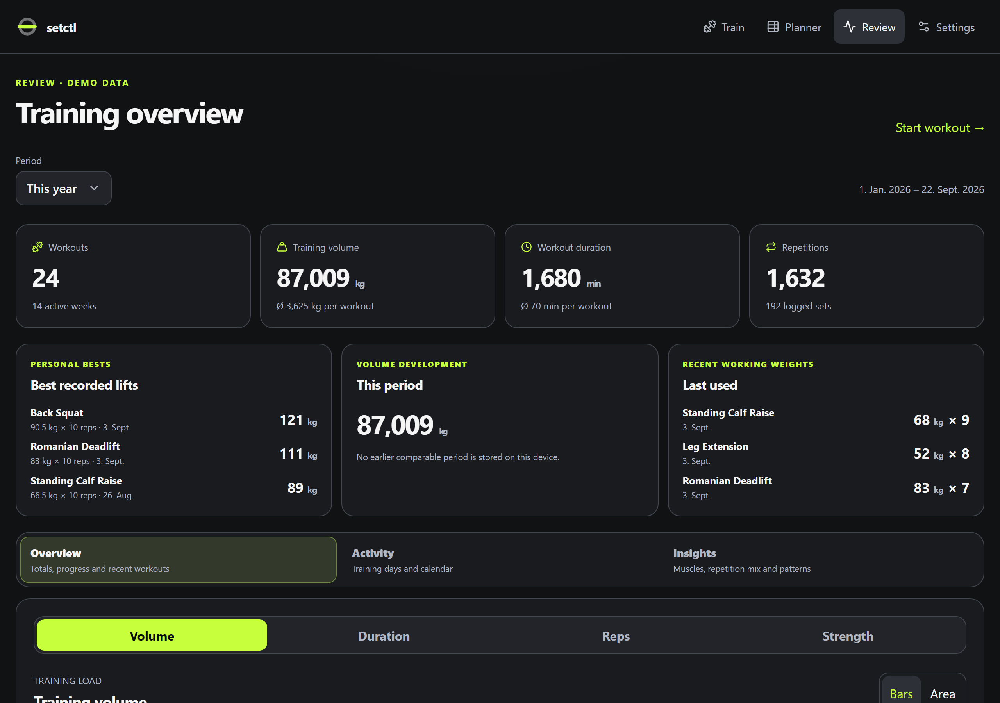
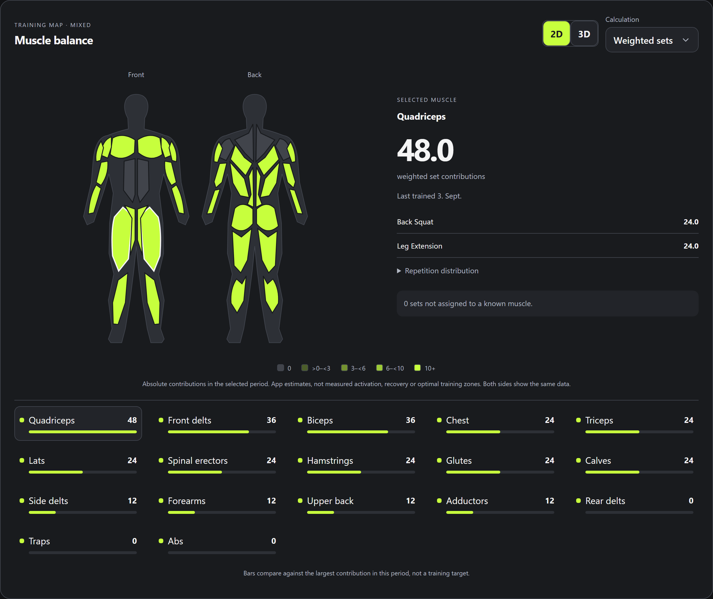
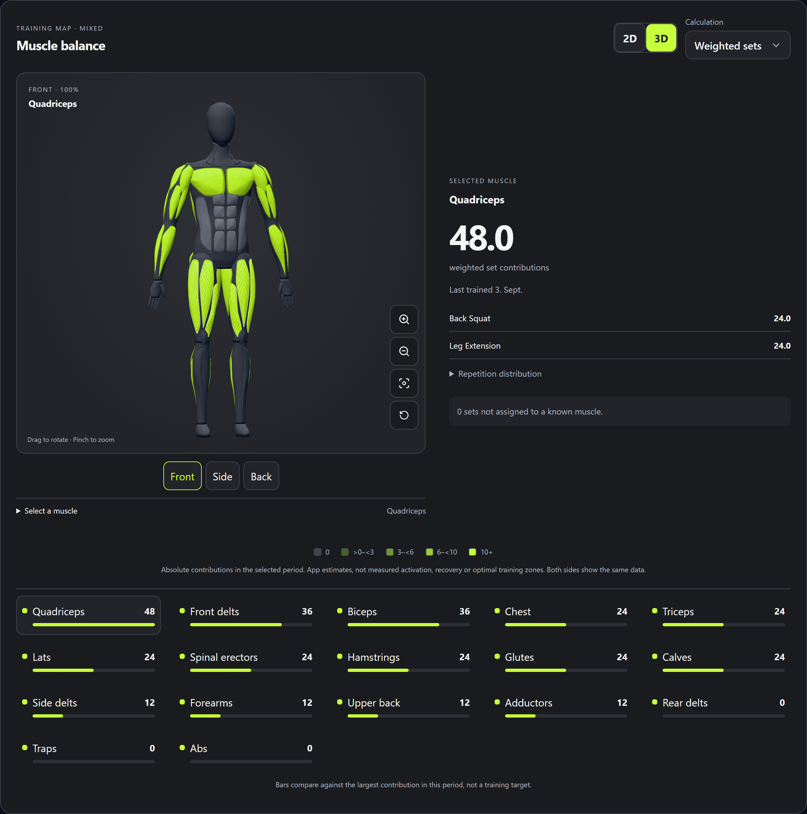
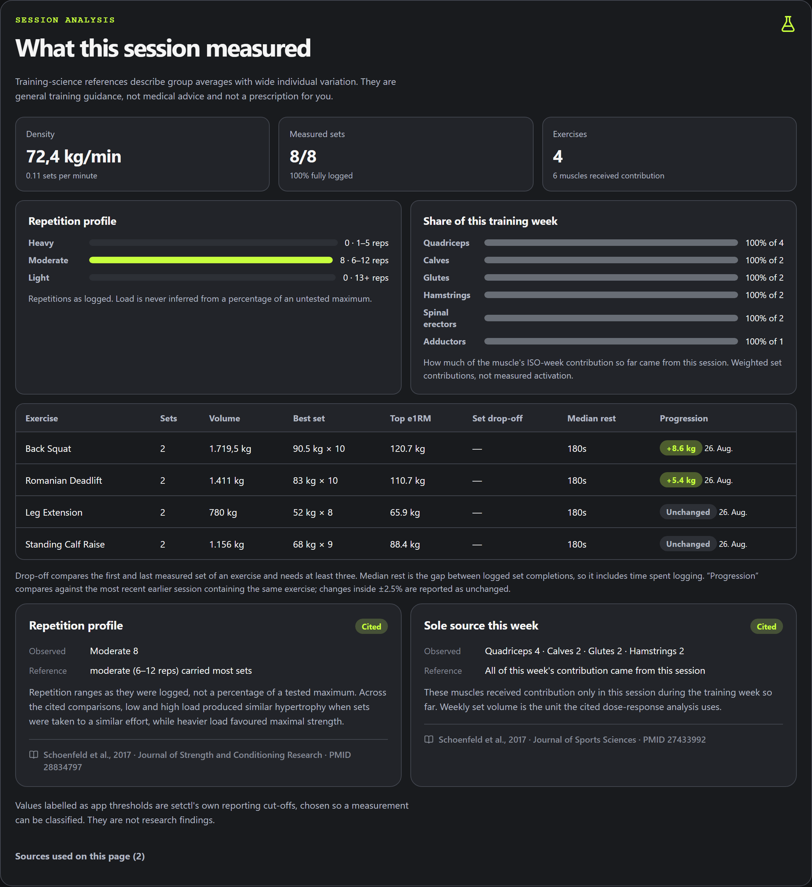
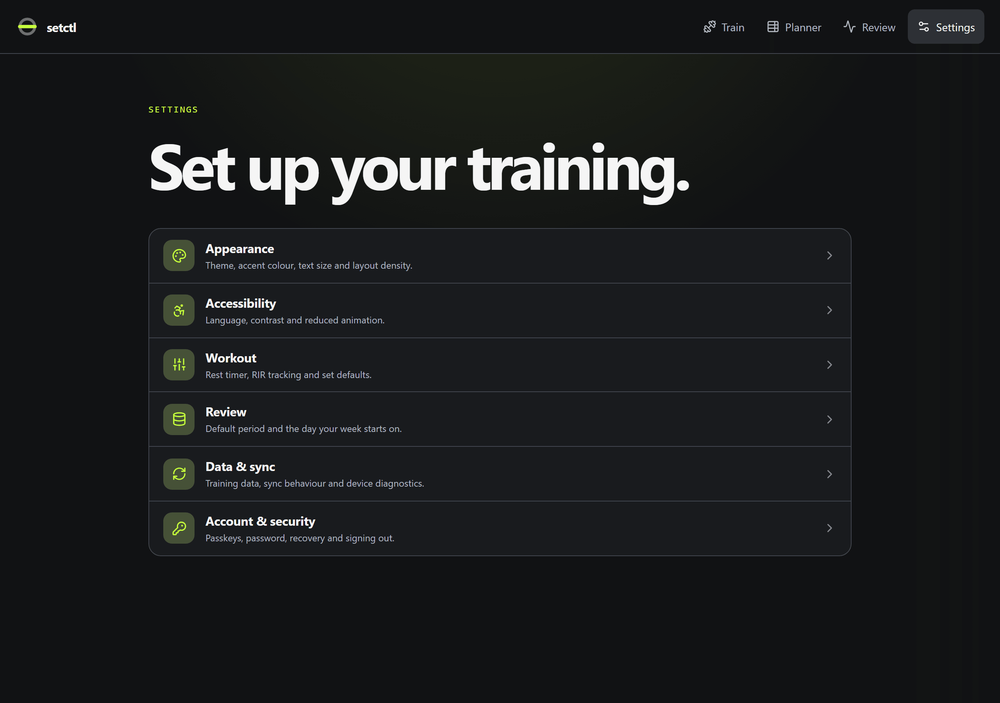
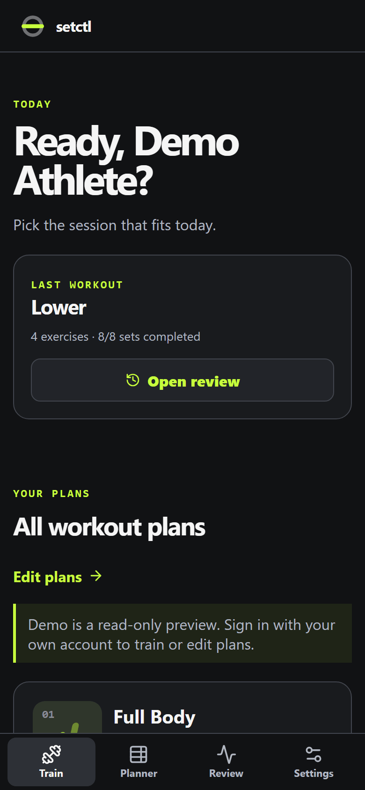
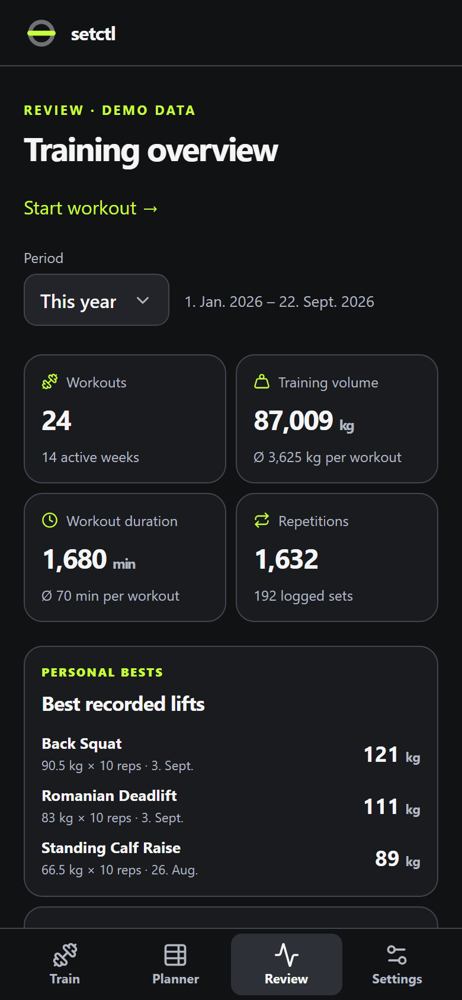
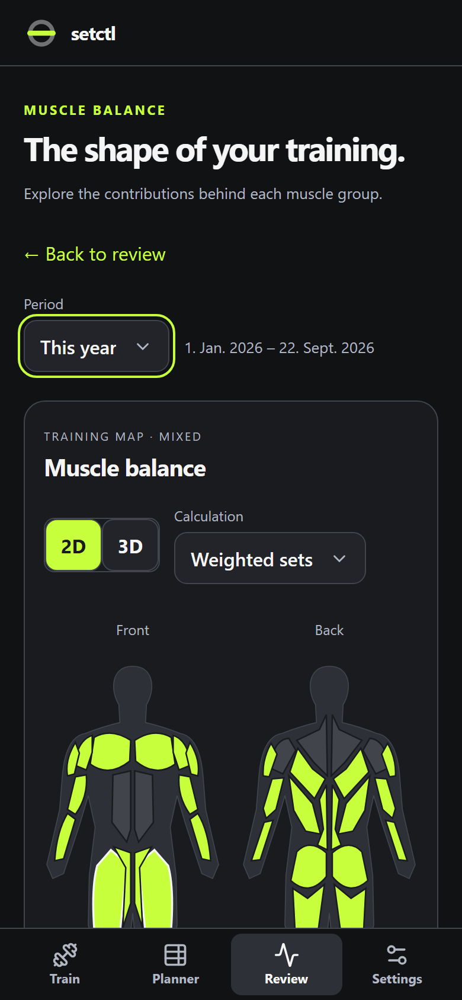
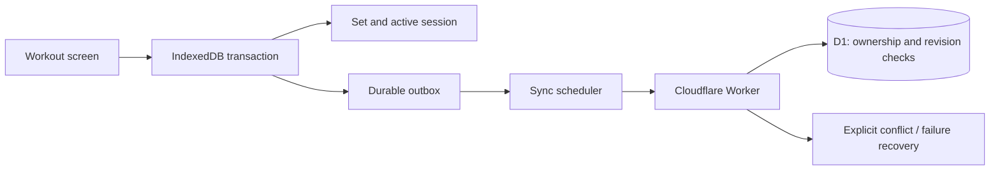

# setctl — Plan. Train. Review.

A workout tracking PWA built around what happens on the gym floor: log a set, adapt the exercise order when equipment is busy, and review progress over time.

**[Try the live demo](https://setctl.pablovaswdfghdvcsd.workers.dev/auth)** · **[Product tour](docs/product-tour.md)** · **[Engineering case study](docs/architecture.md)** · **[Code samples](samples/README.md)**

Built by [paploooov](https://github.com/paploooov) with React, TypeScript, IndexedDB, Cloudflare Workers and D1. Development used AI coding assistance; product requirements, iteration and delivery are documented here through the resulting behavior and engineering decisions.

This public repository is a portfolio case study with selected source samples. The full application and its development history are maintained separately. It is not a self-hosting distribution.

## Try it in one minute

1. Open the [sign-in page](https://setctl.pablovaswdfghdvcsd.workers.dev/auth).
2. Select **Open demo account**. No shared password is needed.
3. Open **Review** to explore 24 sample workouts, weekly volume and strength trends.

The shared demo is read-only. Creating workouts and editing plans require a writable account; demo access does not provide those permissions. On iPhone, follow the app's Home Screen installation guidance.

## Product

| Train | Plan | Review | Body map |
| --- | --- | --- | --- |
| Large set, reps and weight controls | Create and edit reusable plans | Weekly training volume and personal bests | 17 muscle regions in 2D and a rotatable 3D model |
| Local set completion and reload recovery | Search exercises and add custom movements | Estimated one-rep-max trends | Weighted set contributions, coloured by load |
| Reorder untouched exercises for today's workout | Review JSON, CSV, TSV and supported Excel imports | Session analysis with findings cited to PubMed | Falls back to the flat map if WebGL is unavailable |
| Substitute exercises without rewriting the template | Adjust exercise order, sets and rep targets | Data-quality-aware training check-ins | Front and back, driven by the same taxonomy |

All screenshots below are live captures from the public demo account, reproduced unchanged and consistently on the app's default lime accent.

### Pick a session and start training

### See the work add up

### Know your training balance

  
  

Seventeen regions, front and back, coloured by weighted set contribution. The same numbers drive a rotatable 3D model behind the toggle — anatomical surfaces maintained in code, with no external asset. If WebGL is missing, it falls back to the 2D map rather than failing.

### Read what a session actually measured

Findings marked **Cited** carry a verified PubMed record; findings marked **App threshold** are setctl's own reporting cut-offs. The two render differently so they can never be mistaken for one another.

### Make it yours

Settings are grouped by topic instead of stacked on one page, including the theme, accent colour, text size and layout density controls shown in the Appearance section.

### On a phone

The navigation is a thumb-reachable bottom bar, and anything too wide to read stacks into cards instead of hiding behind a horizontal scroller.

| Today | Review | Muscle balance |
| --- | --- | --- |
|  |  |  |

## Engineering highlights

- **Local critical path:** completing a set writes the set, active-session pointer and outgoing mutation in one IndexedDB transaction. No network request is needed to finish the set.
- **Recoverable synchronization:** an outbox schedules revisions and parent/child dependencies; conflicts and failed mutations remain available for explicit recovery.
- **Guarded server writes:** Cloudflare D1 updates use revision predicates and ownership checks. A stale client does not silently overwrite newer work.
- **Workout snapshots:** in-session substitutions and reordering affect the workout, preserving the reusable template.
- **PWA persistence:** cached app assets, reload recovery and platform-specific installation guidance support training with unreliable connectivity.
- **Authentication:** passkeys through WebAuthn, password accounts and role-based administration.

## Verification and boundaries

The application verification run recorded on **7 September 2026** passed **65 client tests, 36 Worker/D1 tests and 36 Chromium/WebKit E2E cases**. Four platform-specific cases were skipped by design. Type checking, lint, formatting, responsive-layout checks, production build and the build security guard passed. These are dated results from the private application, not a claim that this showcase runs that entire suite.

The public repository includes a small independently runnable analytics example. See [verification notes](docs/verification.md) for scope and limitations, including the remaining physical-iPhone Home Screen relaunch check.

## Explore the implementation

- [Atomic workout mutations](samples/workoutMutations.ts): completion, substitution, reordering and their outbox writes.
- [Dependency-aware sync selection](samples/scheduler.ts): revisions, blocked entities and parent ordering.
- [Estimated strength calculations](samples/e1rm.ts): Epley and Brzycki calculations with confidence flags.
- [Architecture and trade-offs](docs/architecture.md).
- [Resume-ready project description](docs/resume.md).

## Media and source

See [media provenance](media/README.md) for screenshot context and mockup labeling. Screenshots and sample code are shared for portfolio review. No general reuse license is granted by this repository; third-party libraries and trademarks retain their respective rights.
