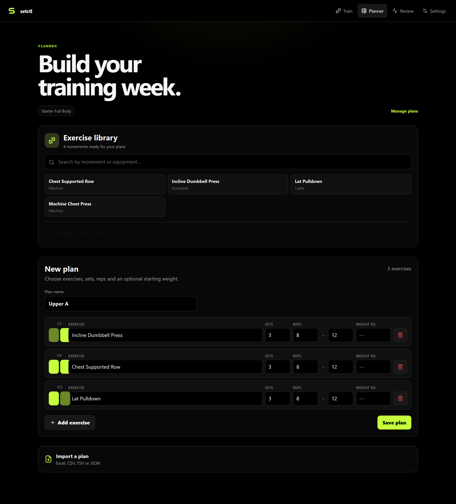
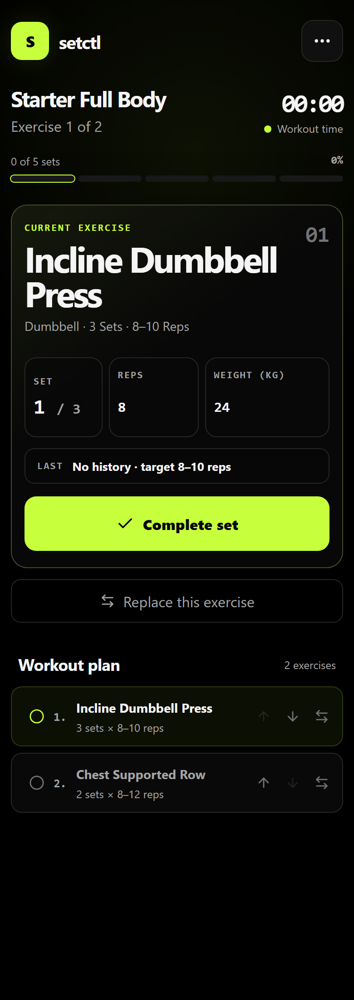
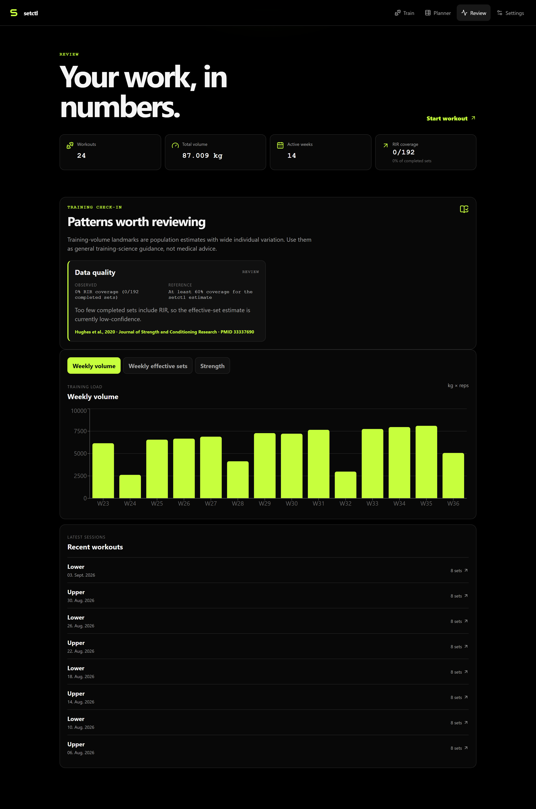

# Product tour

## 1. Plan

Create a training day, choose exercises and set targets. Existing plans can be reopened for editing. Imports are reviewed before they become plans; spreadsheet layouts must still fit the supported parser rather than arbitrary visual formatting.

## 2. Train

Start a workout from a template. The current exercise, set position, reps and weight are the primary controls. Complete sets locally and recover the active session after reload.

If equipment is occupied, drag an untouched exercise on desktop or use up/down buttons on mobile. Use the separate replacement action when you actually want a different movement. Completed work and the reusable plan stay intact.

## 3. Review

Inspect session history, weekly volume and estimated strength trends. The [public demo](https://setctl.pablovaswdfghdvcsd.workers.dev/auth) provides sample history without a password. Choose **Open demo account**, then **Review**. Its shared data is read-only.

